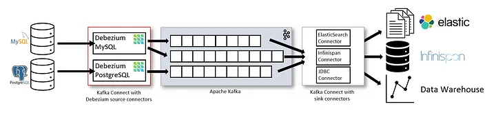

Here's the updated README snippet with the additional instructions included at the end:

---

# cdc-mysql-debezium

Capturing MySQL Database Changes with Debezium

## Introduction

In this guide, we will explore how to capture changes in a MySQL database and stream them using Debezium and Kafka. This approach can help you seamlessly move changes to another server or cloud and provide real-time data streams for analysis or reporting.

## What is Change Data Capture?

Change Data Capture (CDC) is a process that allows organizations to automatically identify and capture database changes. It provides real-time data movements by continuously capturing and processing data as soon as a database event occurs. There are two primary methods for performing CDC:

1. **Log-based**: Tracks database transaction logs.
2. **Query-based**: Uses triggers, timestamps, or snapshots.

## What is Debezium?

Debezium is a tool built on top of Kafka that provides a set of Kafka Connect compatible connectors. It transforms database changes into event streams, allowing applications to detect and respond to row-level changes. Debezium connectors must be present in the Kafka Connect cluster.


*Fig-1: Architecture of Debezium (Connector Role)*

Debezium offers connectors for Cassandra, Db2, MongoDB, MySQL, Oracle Database, PostgreSQL, SQL Server, and Vitess databases. It can be used as an embedded library in custom Java applications or as a standalone server.

## Example with Debezium MySQL Connector

### Prerequisites

- Docker and Docker Compose installed.

### Setup

Create a `docker-compose-mysql.yaml` file:

```yaml
version: '2'
services:
  zookeeper:
    image: quay.io/debezium/zookeeper:2.0
    ports:
     - 2181:2181
     - 2888:2888
     - 3888:3888
  kafka:
    image: quay.io/debezium/kafka:2.0
    ports:
     - 9092:9092
    links:
     - zookeeper
    environment:
     - ZOOKEEPER_CONNECT=zookeeper:2181
  mysql:
    image: quay.io/debezium/example-mysql:2.0
    ports:
     - 3306:3306
    environment:
     - MYSQL_ROOT_PASSWORD=debezium
     - MYSQL_USER=mysqluser
     - MYSQL_PASSWORD=mysqlpw
  connect:
    image: quay.io/debezium/connect:2.0
    ports:
     - 8083:8083
    links:
     - kafka
     - mysql
    environment:
     - BOOTSTRAP_SERVERS=kafka:9092
     - GROUP_ID=1
     - CONFIG_STORAGE_TOPIC=my_connect_configs
     - OFFSET_STORAGE_TOPIC=my_connect_offsets
     - STATUS_STORAGE_TOPIC=my_connect_statuses
```

Run the services:

```sh
docker-compose -f docker-compose-mysql.yaml up -d
docker-compose -f docker-compose-mysql.yaml ps
```

### Database Setup

Connect to the MySQL database:

```sh
docker-compose -f docker-compose-mysql.yaml exec mysql bash -c 'mysql -u root -pdebezium'
```

Create a new database and user:

```sql
CREATE DATABASE dataops;
GRANT ALL ON dataops.* TO 'debezium'@'%';
FLUSH PRIVILEGES;
```

Create a table:

```sql
CREATE TABLE dataops.example(
    customerId int,
    customerFName varchar(255),
    customerLName varchar(255),
    customerCity varchar(255)
);
```

### Kafka Connect Setup

Create a `register-mysql.json` file with the connector configuration:

```json
{
  "name": "dataops-connector",
  "config": {
    "connector.class": "io.debezium.connector.mysql.MySqlConnector",
    "database.hostname": "mysql",
    "database.port": "3306",
    "database.user": "debezium",
    "database.password": "dbz",
    "topic.prefix": "dbserver1",
    "database.server.id": "184054",
    "database.include.list": "dataops",
    "schema.history.internal.kafka.bootstrap.servers": "kafka:9092",
    "schema.history.internal.kafka.topic": "schema-changes.dataops"
  }
}
```

Register the connector:

```sh
curl -i -X POST -H "Accept:application/json" -H "Content-Type:application/json" \
    http://localhost:8083/connectors/ -d @register-mysql.json
```

### Listening to Changes

List Kafka topics:

```sh
docker-compose -f docker-compose-mysql.yaml exec kafka /kafka/bin/kafka-topics.sh \
    --bootstrap-server kafka:9092 --list
```

Consume messages:

```sh
docker-compose -f docker-compose-mysql.yaml exec kafka /kafka/bin/kafka-console-consumer.sh \
    --bootstrap-server kafka:9092 --from-beginning --property print.key=true --topic dbserver1.dataops.example
```

### Perform Database Operations

Insert records:

```sql
INSERT INTO example VALUES 
(1, "Richard", "Hernandez", "Brownsville"),
(2, "Mary", "Barrett", "Littleton"),
(3, "Ann", "Smith", "Caguas"),
(4, "Mary", "Jones", "San Marcos"),
(5, "Robert", "Hudson", "Caguas");
```

Update a record:

```sql
UPDATE example SET customerCity = 'Ocean Drive' WHERE customerId = 1;
```

Delete a record:

```sql
DELETE FROM example WHERE customerId = 1;
```

### Additional Commands

Start the topology as defined in the [Debezium tutorial](https://debezium.io/documentation/reference/stable/tutorial.html):

```sh
export DEBEZIUM_VERSION=2.1
docker-compose -f docker-compose-mysql.yaml up
```

Start MySQL connector:

```sh
curl -i -X POST -H "Accept:application/json" -H "Content-Type:application/json" http://localhost:8083/connectors/ -d @register-mysql.json
```

Consume messages from a Debezium topic:

```sh
docker-compose -f docker-compose-mysql.yaml exec kafka /kafka/bin/kafka-console-consumer.sh \
    --bootstrap-server kafka:9092 \
    --from-beginning \
    --property print.key=true \
    --topic dbserver1.inventory.customers
```

Modify records in the database via MySQL client:

```sh
docker-compose -f docker-compose-mysql.yaml exec mysql bash -c 'mysql -u $MYSQL_USER -p$MYSQL_PASSWORD inventory'
```

Shut down the cluster:

```sh
docker-compose -f docker-compose-mysql.yaml down
```

## Conclusion

With Debezium and Kafka, you can effectively capture and stream database changes. This setup allows you to track changes in real-time and respond accordingly, enhancing your data processing capabilities.

## Resources

- [Debezium Documentation](https://debezium.io/documentation/reference/stable/tutorial.html)
- [Kafka Documentation](https://kafka.apache.org/documentation.html#connect)
- [Debezium MySQL Connector](https://debezium.io/documentation/reference/stable/connectors/mysql.html)

---